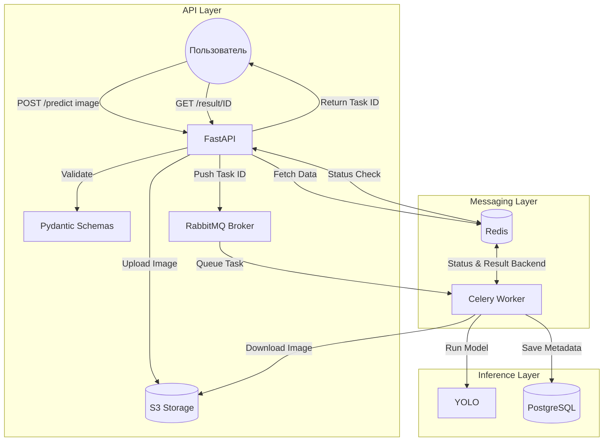

# license-plate-detection-api
Backend service for automatic license plate recognition\
Асинхронный ML-сервис для детекции и распознавания автомобильных номерных знаков. 


В проекте реализована архитектура взаимодействия веб-сервера и ML-модели (YOLO) через брокер сообщений. Архитектура включает сохранение изображений в S3-хранилище, кэширование статусов задач в Redis и хранение метаданных и результатов инференса модели в PostgreSQL.

## Структура проекта
```
.
├── backend_service
│   ├── api
│   │   ├── main.py                 # API Gateway
│   │   ├── routers
│   │   │   └── detect.py           # Эндпоинты для детекции 
│   │   └── schemas.py              # Pydantic-схемы для валидации
│   ├── core
│   │   ├── config.py               # Конфигурация
│   │   ├── model_runner.py         # Класс для инференса CV-модели
│   │   └── s3_client.py            # Интеграция с S3-хранилищем
│   ├── db
│   │   ├── engine.py               # Подключение к PostgreSQL
│   │   └── models.py               # ORM-модели БД
│   ├── test.py
│   └── worker
│       ├── celery_app.py           # Инициализация Celery
│       └── tasks.py                # Фоновые задачи 
├── docker-compose.yml
├── Dockerfile
├── env.example
├── poetry.lock
├── pyproject.toml
├── README.md
```
## Архитектура системы


## Технологический стек
* **ML:** PyTorch, Ultralytics YOLOv11, OpenCV
* **Backend:** FastAPI, Pydantic, Uvicorn, SQLAlchemy
* **Storage:** PostgreSQL, S3 
* **Task Queue:** Celery, RabbitMQ, Redis
* **Infrastructure:** Docker Compose

## Работа с данными
*   **Датасет:** 7540 изображений (6725 train / 815 val). 
*   **Разметка (Zero-shot + Manual):** автоматическая предразметка с помощью **SAM 3** с последующей ручной корректировкой в **CVAT**.
*   **Обучение:** 
    *   **Архитектура:** `YOLOv11s`.
    **Гиперпараметры инференса**: NMS IoU = 0.7, Conf Threshold = 0.58 (подобран на валидационной части).
*   **Текущие метрики:** 
    *   **Val (815 объектов):** `mAP@0.5 = 0.989` | `mAP@0.5:0.95 = 0.845`
    *   **Test (Скрытая часть):** `mAP = 0.74`


## Инструкция по локальному запуску
1. Запуск контейнеров RabbitMQ, Redis, S3, PostgreSQL
```
docker compose up -d
```
2. Настройка окружения: скопируйте и заполните конфиг, установите зависимости
```
cp .env.example .env
poetry install
```
3. Запуск Celery воркера (в отдельном терминале)
```
celery -A backend_service.worker.celery_app worker --loglevel=info -P threads
```
4. Запуск FastAPI (в отдельном терминале)
```
uvicorn backend_service.api.main:app --reload
```
Swagger UI доступен по адресу: ```http://localhost:8000/docs```

## TODO
1. Внедрить обработку ошибок.
2. Добавить пайплайн распознавания текста (OCR задача) на задетектированных автомобильных знаках.
3. Завернуть все компоненты в единый docker-compose.yml.
